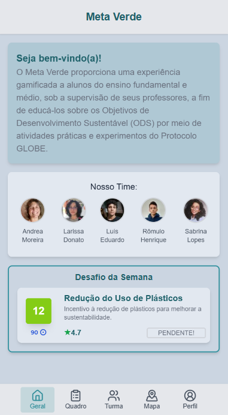
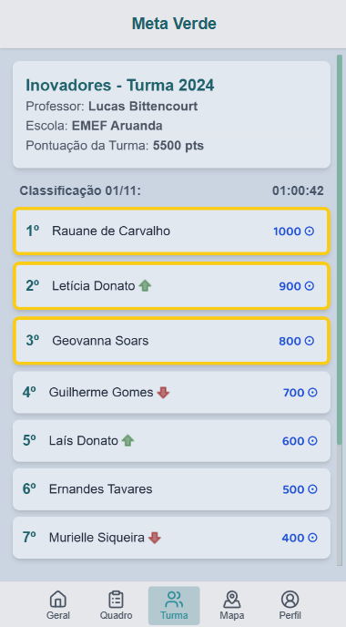

# Lari & Outros - NASA Space Apps 2024

Team Lari & Outros: Showing how funny is the Science! Providing playful learning, an engaging cause, fun and healthy competition to raise awareness and engage young people in the SDGs.

## About Project

The “Meta Verde” app is a platform that provides a gamified experience to high school students, under the supervision of their teachers, in order to educate them about the Sustainable Development Goals (SDGs) using the experiments and practical activities of the GLOBE Protocol. By engaging young people with practical activities in the classroom and outdoors, as well as allowing teachers to add their own activities to the platform.

### Demonstration

## About Code
We made the Client with Next, React, Tailwind, all designed for integration with the Server.
As you can see, the content is dynamically generated based on jsons contained in data.

Deploy: https://missao-verde.vercel.app/overview

## About Team

| Name            | Role                       | Location             |
|-----------------|----------------------------|----------------------|
| Andrea Moreira  | Business Manager           | João Pessoa, PB - BR |
| Larissa Donato  | Project Manager            | João Pessoa, PB - BR |
| Sabrina Lacerda | Biotechnology Scientist    | João Pessoa, PB - BR |
| Luís Eduardo    | Software Developer         | João Pessoa, PB - BR |
| Rômulo Henrique | Technology Manager         | João Pessoa, PB - BR |